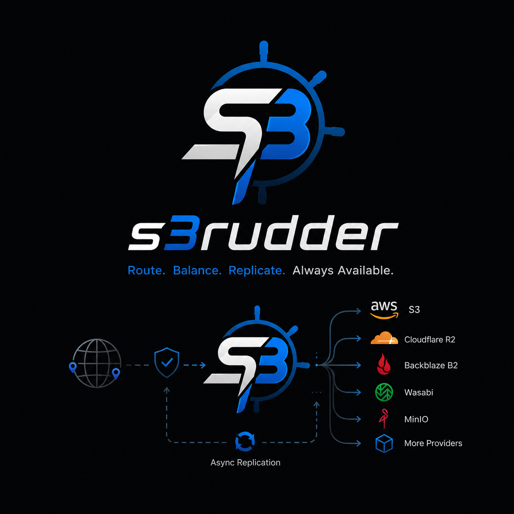

# S3Rudder



A high-performance, S3-compatible reverse proxy and load balancer that routes traffic across multiple S3 providers (AWS S3, Cloudflare R2, Backblaze B2, Wasabi, MinIO, etc.) with automatic failover, geo-aware redirect, and background async replication.

```
Client (aws-cli / SDK)
        │  SigV4
        ▼
  ┌─────────────┐        health checks
  │  S3Rudder   │◄────────────────────────┐
  │  :8080      │                         │
  └──────┬──────┘                  ┌──────┴──────┐
         │                         │HealthMonitor│
    ┌────┴─────────────────┐       └─────────────┘
    │  routing decision    │
    │  (policy + weight)   │
    └────┬────────┬────────┘
         │        │  async replication queue (BoltDB)
         ▼        ▼
   ┌──────────┐  ┌──────────┐  ┌──────────┐
   │ Provider │  │ Provider │  │ Provider │
   │  AWS S3  │  │  CF R2   │  │  MinIO   │
   └──────────┘  └──────────┘  └──────────┘
```

## Features

- **Transparent S3 proxy** — clients use standard AWS SDK / CLI; no code changes needed
- **SigV4 re-signing** — authenticates clients with rudder credentials, re-signs outbound requests with backend credentials
- **Read policies**
  - `failover` — try backends in weight order; transparently fall back on 5xx or timeout
  - `round-robin` — distribute reads evenly across healthy backends
  - `latency` — always pick the fastest backend (lowest measured RTT)
- **Write policy** — `weight_async`: write to one backend (chosen by weight), asynchronously replicate to others
- **Read modes**
  - `proxy` — stream the object body through the rudder (default)
  - `redirect` — return HTTP 302 with a Pre-signed URL; client fetches directly from S3 (saves rudder bandwidth, enables geo-routing)
- **Persistent replication queue** (BoltDB) — survives restarts, exponential retry backoff, dead-letter bucket
- **Health monitoring** — per-backend HEAD probes with configurable interval and timeout; latency measurement
- **Full reconciliation sync** — `s3rudder -sync` compares all objects via `ListObjectsV2` and copies missing/stale ones
- **Zero in-memory object buffering** — streams all data via AWS S3 Manager Uploader (no full in-memory buffering)

## Quick Start (local dev with Docker)

**Prerequisites**: Docker + Docker Compose

```bash
# 1. Clone and start
git clone https://github.com/AlexKutas/s3rudder
cd s3rudder
docker compose up --build

# Services:
#   s3rudder          → http://localhost:8080  (your S3 endpoint)
#   minio-primary     → http://localhost:9001  (S3 API)
#   minio-secondary   → http://localhost:9002  (S3 API)
#   minio console 1   → http://localhost:9091
#   minio console 2   → http://localhost:9092
```

**Upload a file via AWS CLI:**

```bash
aws s3 cp README.md s3://test-bucket/README.md \
  --endpoint-url http://localhost:8080 \
  --aws-access-key-id rudder-key \
  --aws-secret-access-key rudder-secret \
  --no-verify-ssl
```

**List objects:**

```bash
aws s3 ls s3://test-bucket/ \
  --endpoint-url http://localhost:8080 \
  --aws-access-key-id rudder-key \
  --aws-secret-access-key rudder-secret
```

**Test failover** — stop primary and read a file:

```bash
docker stop minio-primary

aws s3 cp s3://test-bucket/README.md /tmp/README-from-secondary.md \
  --endpoint-url http://localhost:8080 \
  --aws-access-key-id rudder-key \
  --aws-secret-access-key rudder-secret
# ✅ transparently served from secondary
```

**Run a full manual sync:**

```bash
docker run --rm \
  -v $(pwd)/config.dev.yaml:/etc/s3rudder/config.yaml:ro \
  --network s3-router_default \
  s3-router-s3rudder \
  -config /etc/s3rudder/config.yaml -sync
```

## Configuration

Copy and edit the template:

```bash
cp config.yaml config.local.yaml
```

```yaml
server:
  port: 8080
  access_key: "rudder-key"      # credentials clients use to talk to the rudder
  secret_key: "rudder-secret"

backends:
  - name: "aws-us-east"
    endpoint: "https://s3.us-east-1.amazonaws.com"
    region: "us-east-1"
    access_key: "AWS_ACCESS_KEY_ID"
    secret_key: "AWS_SECRET_ACCESS_KEY"
    bucket: "my-primary-bucket"
    weight: 70          # share of write traffic (relative to total)
    path_style: false   # false for AWS; true for MinIO, R2

  - name: "cloudflare-r2"
    endpoint: "https://<account-id>.r2.cloudflarestorage.com"
    region: "auto"
    access_key: "R2_KEY"
    secret_key: "R2_SECRET"
    bucket: "my-backup-bucket"
    weight: 30
    path_style: true

routing:
  read_policy: "failover"       # failover | round-robin | latency
  write_policy: "weight_async"  # weight_async | primary_only
  read_mode: "proxy"            # proxy | redirect
  redirect_ttl: "15m"           # Pre-signed URL lifetime (redirect mode)
  sync_interval: "30m"          # periodic background sync interval (e.g. 30m, 1h, 0 to disable)
  cleanup_interval: "12h"       # periodic background cleanup/orphan deletion (0 to disable)


queue:
  db_path: "queue.db"   # BoltDB file location
  workers: 4
  retry_limit: 5
  retry_backoff: "5s"
```

## Configuration Reference

### Server Configuration

| Key | Description | Default |
|-----|-------------|---------|
| `server.port` | HTTP port the S3Rudder proxy listens on | `8080` |
| `server.access_key` | Access key ID that clients must use to authenticate | (Required) |
| `server.secret_key` | Secret access key that clients must use to authenticate | (Required) |

### Backend options

| Key | Description |
|-----|-------------|
| `name` | Unique identifier (used in logs and replication tasks) |
| `endpoint` | Full base URL of the S3-compatible API |
| `region` | AWS region or `"auto"` for R2 |
| `access_key` / `secret_key` | Backend credentials (never exposed to clients) |
| `bucket` | Bucket name on this backend |
| `weight` | Integer 1–100; controls write traffic distribution |
| `path_style` | `true` for path-style URLs (MinIO, R2); `false` for virtual-hosted (AWS) |
| `health_check.object_key` | Key of the canary object used for probes (default: `.s3rudder-health`) |
| `health_check.interval` | How often to probe (default: `15s`) |
| `health_check.timeout` | Per-probe deadline (default: `5s`) |

### Routing Options

| Key | Description | Default |
|-----|-------------|---------|
| `routing.read_policy` | Policy to select read backend: `failover` (by weight, failover on error) \| `round-robin` (even distribution) \| `latency` (lowest RTT) | `failover` |
| `routing.write_policy` | Policy for write requests: `weight_async` (write to one, replicate to others async) \| `primary_only` (write only to primary) | `weight_async` |
| `routing.read_mode` | Mode to deliver GET responses: `proxy` (stream through proxy) \| `redirect` (302 redirect with pre-signed URL) | `proxy` |
| `routing.redirect_ttl` | Pre-signed URL lifetime in redirect mode (e.g. `"15m"`) | `"15m"` |
| `routing.sync_interval` | Interval for full background reconciliation (e.g. `"30m"`, `0` to disable) | `0` (disabled) |
| `routing.cleanup_interval` | Interval for background orphan deletion (e.g. `"12h"`, `0` to disable) | `0` (disabled) |

### Replication Queue Options

| Key | Description | Default |
|-----|-------------|---------|
| `queue.db_path` | File path to BoltDB replication database | `"queue.db"` |
| `queue.workers` | Number of concurrent async replication workers | `4` |
| `queue.retry_limit` | Max retry attempts before moving a task to the dead-letter bucket | `5` |
| `queue.retry_backoff` | Base retry backoff duration (doubled exponentially on each retry, e.g. `"5s"`) | `"5s"` |


## Architecture Overview

```
config.go    — YAML configuration parsing and validation
health.go    — per-backend health probes, latency measurement, S3 client factory
signer.go    — AWS SigV4 request validation (inbound) and re-signing (outbound)
              + Pre-signed URL generation for redirect mode
queue.go     — BoltDB-backed persistent replication queue
              + worker pool with exponential-backoff retry and dead-letter bucket
sync.go      — weight-based and latency-based backend selection
              + streaming object copy via AWS S3 Manager (no full in-memory buffering)
              + full ListObjectsV2-based reconciliation for manual sync
proxy.go     — HTTP handler: auth, S3 path parsing, read/write routing,
              proxy mode, redirect mode, failover, passthrough for other ops
main.go      — entry point: server mode (default) and CLI sync mode (-sync)
```

## CLI Usage

```
Usage:
  s3rudder [flags]

Flags:
  -config string         Path to configuration file (default: config.yaml)
  -sync                  Run a full sync from first backend to all others, then exit
  -delete-orphans        When syncing, delete objects in dst that don't exist in src
```

Examples:

```bash
# Start the proxy server
s3rudder -config /etc/s3rudder/config.yaml

# One-shot full sync (e.g. from a cron job)
s3rudder -config /etc/s3rudder/config.yaml -sync

# Sync and remove objects deleted from the source
s3rudder -config /etc/s3rudder/config.yaml -sync -delete-orphans
```

## Building

All build steps run inside Docker — nothing is installed on the host machine.

```bash
# Build the binary inside Docker and output to ./s3rudder
docker run --rm -v "$(pwd)":/app -w /app golang:latest \
  go build -ldflags="-s -w" -o s3rudder .

# Build and tag the production Docker image
docker build -t s3rudder:latest .
```

## Deployment

**Docker run:**

```bash
docker run -d \
  --name s3rudder \
  -p 8080:8080 \
  -v /path/to/config.yaml:/etc/s3rudder/config.yaml:ro \
  -v s3rudder-queue:/app \
  s3rudder:latest
```

**Docker Compose (production template):**

```yaml
services:
  s3rudder:
    image: s3rudder:latest
    restart: always
    ports:
      - "8080:8080"
    volumes:
      - ./config.yaml:/etc/s3rudder/config.yaml:ro
      - queue-data:/app
    environment:
      - TZ=UTC

volumes:
  queue-data:
```

## How Failover Works

1. Client sends `GET /bucket/file.jpg` → S3Rudder
2. Rudder selects backends ordered by the `read_policy`
3. Rudder tries the first backend — if the response is `5xx` or a network timeout, it logs the error and tries the next backend
4. The first successful response is streamed back to the client
5. **The client never sees the error** — the retry is fully transparent

## How Async Replication Works

1. Client sends `PUT /bucket/file.jpg` → S3Rudder
2. Rudder selects one healthy backend by `weight` and writes the object
3. After a successful write, a `ReplicationTask` is enqueued in BoltDB for every other backend
4. Background workers drain the queue, streaming objects between providers with AWS S3 Manager
5. If a replication attempt fails, it is retried with exponential backoff (up to `retry_limit` times)
6. Exhausted tasks are moved to a dead-letter bucket in BoltDB for manual inspection

## Supported S3 Providers

| Provider | `path_style` | Notes |
|----------|-------------|-------|
| AWS S3 | `false` | Virtual-hosted style; use the region-specific endpoint |
| Cloudflare R2 | `true` | Set `region: auto` |
| Backblaze B2 | `true` | Use S3-compatible endpoint |
| Wasabi | `false` | Use regional endpoint |
| MinIO | `true` | Path-style required |
| Any S3-compatible API | varies | Check provider docs |

## License

MIT
